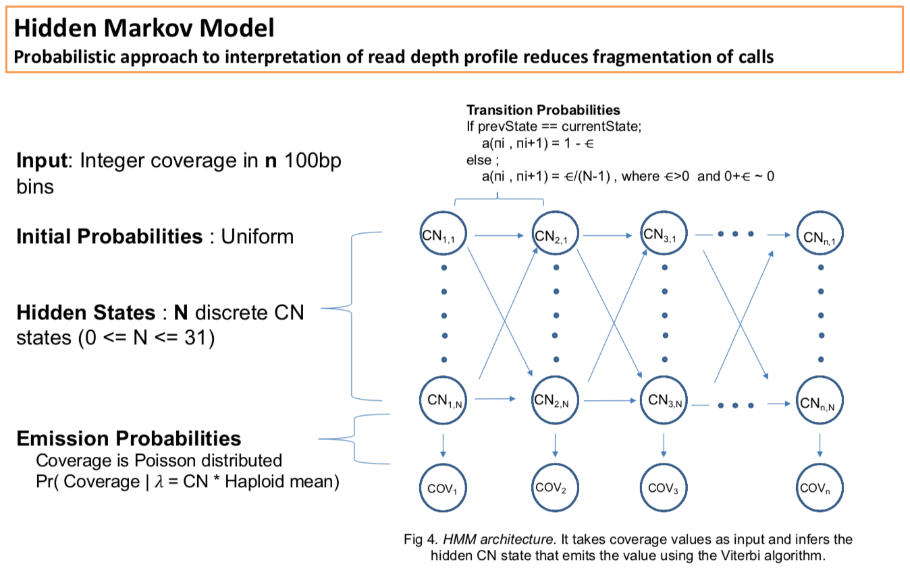

# hmcnc - Hidden Markov Copy Number Caller
## Tool for calling CNVs based on read depth and SNV signatures

---



---

### Requirements
- gcc
- meson
- ninja

### install
- clone the repo
- build the repo with meson and ninja

```
cd hmcnc ; mkdir build ; cd build ; meson .. ; ninja
```

### usage
```
Hidden Markov Copy Number Caller

Usage: ./src/hmcnc [OPTIONS] reference

Positionals:
  reference FILE REQUIRED     Read reference from this FASTA file.

Options:
  -h,--help                   Print this help message and exit

Input:
  -a FILE                     Read alignments from this BAM file and calculate depth on the fly.
  -b FILE                     Read depth bed from this file (skip calculation of depth).
  -s FILE                     Read SNVs from this file (when not estimating from a BAM).
  -p FILE                     Read parameter file (do not train with Baum-Welch).
  -l FILE                         ** Need description for clipInFileName **

Depth Calculation:
  -e FLOAT                    Value of log-epsilon. [-800]
  -m TEXT                     Coverage model to use: Poisson (pois), or negative binomial (nb). [nb]
  -t INT                      Number of threads. [4]
  -c TEXT                     Use this contig to estimate coverage. By default, longest contig.

Output:
  -o FILE                     Output vcf to this file. Write to stdout if not provided.
  --sample TEXT               Sample name in the vcf ['sample']
  -M                          Merge consecutive bins with the same copy number.
  -C TEXT                     Only run hmm on this chrom.
  -B FILE                     Write coverage bed to this file.
  -P FILE                     Write trained parameter file.
  -L FILE                         ** Need description for clipOutFileName **
  -S FILE                     Write SNVs to this file.
```
### example

```
hmcnc human_GRCh38_no_alt_analysis_set.fasta -a HG002.GRCh38.deepvariant.haplotagged.bam -t 20 -o out.vcf
```
