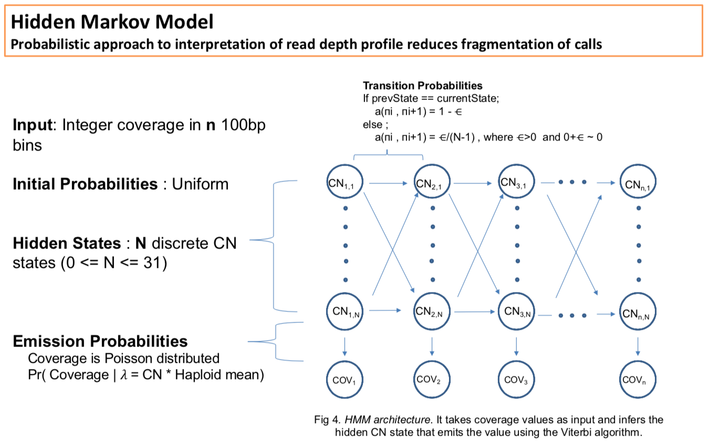

# hmcnc - Hidden Markov Copy Number Caller
## Tool for calling CNVs based on read depth, SNV signatures, and clipping signatures

---



---

### Requirements
- g++ (>=11)
- htslib (>=1.4)
- boost
- zlib
- *Optional:* meson, ninja (for alternate build)

### Installation

#### Using Conda (Recommended)
```bash
git clone https://github.com/chaissonlab/hmcnc.git
cd hmcnc
conda create -n hmcnc -c conda-forge gxx htslib boost samtools bedtools tabix
conda activate hmcnc
cd src && make
```

#### Using Docker
```bash
git clone https://github.com/chaissonlab/hmcnc.git
cd hmcnc
docker build -t hmcnc -f hmcnc_docker .
docker run --rm -v $(pwd):/data hmcnc -a /data/sample.bam /data/hg38.fa
```

#### Using Meson
```bash
cd hmcnc ; mkdir build ; cd build ; meson .. ; ninja
```

### Usage
```text
hmcnc [OPTIONS] reference

Positionals:
  reference FILE REQUIRED     Read reference from this FASTA file.

Options:
  -h,--help                   Print this help message and exit

Input:
  -a FILE                     Read alignments from this BAM file and calculate depth on the fly.
  -b FILE                     Read depth bed from this file (skip calculation of depth).
  -s FILE                     Read SNVs from this file (when not estimating from a BAM).
  -p FILE                     Read parameter file (do not train with Baum-Welch).
  -l FILE                     Read clipping signature file (when not estimating from a BAM). 
  --exclude-regions TEXT      Path to a BED file specifying genomic regions to exclude from coverage accumulation.
                              These regions will be ignored during parameter estimation.

Depth Calculation:
  -e FLOAT                    Value of log-epsilon. [-800]
  --epsi-weight FLOAT         Emission penalty weight for non-diploid states [1.0]. Fraction of per-bin NB LLR penalty applied at each bin: 1.0 = full (100-bin equivalent), 0.5 = half, 0.0 = disabled.
  --merge-bridge INT=100      Max CN=2 bridge length (bp) to absorb when forming composite non-diploid blocks.
                              Adjacent non-diploid segments separated by a CN=2 gap <= this threshold are merged.
  -m TEXT                     Coverage model to use: Poisson (pois), or negative binomial (nb). [nb]
  -t INT                      Number of threads. [4]
  -c TEXT                     Use this contig to estimate coverage. By default, longest contig.

Statistics Override:
  --wg-mean FLOAT             Use this as haploid mean coverage (skip estimation from data).
  --wg-var FLOAT              Use this as coverage variance (skip estimation from data).
  --wg-clip-mean FLOAT        Use this as mean clip count per bin (skip estimation from data).
  --wg-clip-var FLOAT         Use this as clip variance (skip estimation from data).
  --stats-only                Compute and output statistics to stderr, then exit (no HMM run).

Output:
  -o FILE                     Output vcf to this file. Write to stdout if not provided.
  --sample TEXT               Sample name in the vcf ['sample']
  -M                          Merge consecutive bins with the same copy number.
  -C TEXT                     Only run hmm on this chrom.
  -B FILE                     Write coverage bed to this file.
  -P FILE                     Write trained parameter file.(4 iterations)
  --readLength INT            Set the average read length, special treatment of calls under this length.
  -L FILE                     Stores the number of reads with clipping > 500 bases in each bin.
  -S FILE                     Write SNVs to this file.
  --writeFail                 Write calls flagged as FAIL.
  --bed FILE                  Output calls in bed format to this file.
  --output-all PREFIX         Output all files with this prefix (sets -o, -P, -B, -L, -S, --bed).
```

### Repository Structure

- `src/` - Core C++ source code for the HMM and statistical modeling
- `include/` - C++ header files and definitions
- `benchmarks/` - Snakemake pipelines and bash scripts used to run validation against HG002 truth sets
- `tests/` - Standalone integration tests (e.g., single-chrom testing with global statistics)
- `docs/` - Documentation files, including architecture roadmaps
- `data/` - Test data inputs used for iterative validation

### Advanced Usage Examples

**1. Basic Calling from BAM:**
```bash
hmcnc human_GRCh38_no_alt_analysis_set.fasta -a HG002.GRCh38.bam -t 20 -o out.vcf
```

**2. Composite Block Merging & BED Output:**
By default, the HMM outputs contiguous CNV states at bin-level resolution. To merge them into structured composite blocks—bridging over short noisy gaps of diploid (CN=2) states—use the `-M` and `--merge-bridge` flags.
```bash
hmcnc hg38.fa -a sample.bam -M --merge-bridge 200 --bed composite_calls.bed
```
This produces `composite_calls.bed` with advanced metrics like `domCN` (majority copy number state), `lwCN` (length-weighted copy number), and `peakCN` (maximum absolute CN state).

**3. Single-Chromosome Testing with Custom WG Stats & Exclusion Mask:**
If you want to run the HMM on a single chromosome (e.g. `chr22`) without re-estimating global stats, you can extract stats first using `--stats-only`, and pass them as overrides. You can also exclude pericentromeric regions using `--exclude-regions`.
```bash
# Step 1: Get stats only (optional, can also be computed genome-wide first)
hmcnc hg38.fa -a sample.bam --stats-only

# Step 2: Run only on chr22, overriding the parameters manually
hmcnc hg38.chr22.fa -a HG002.chr22.bam \
  -C chr22 \
  --wg-mean 35.2 --wg-var 80.1 --wg-clip-mean 3.4 --wg-clip-var 12.0 \
  --exclude-regions hg38.region_to_EXCLUDE.bed \
  --bed out.bed -o out.vcf
```

**4. Tuning the Emission Penalty:**
To strictly suppress short, spurious CNV calls in noisy genomic regions, you can penalize the emission likelihoods of non-diploid states using the `--epsi-weight` parameter.
```bash
hmcnc hg38.fa -a sample.bam --epsi-weight 1.5 -o strict_calls.vcf
```

---

### Key Features Explained

#### 1. Negative Binomial (NB) & Zero-Inflated Negative Binomial (ZINB) Models
Traditional Poisson coverage models fail on long-read datasets because variance (overdispersion) typically exceeds the mean. `hmcnc` addresses this by modeling **read depth** using a standard **Negative Binomial (NB)** distribution, and **clipping signatures** using a **Zero-Inflated Negative Binomial (ZINB)** distribution to handle excess zero-observations at non-breakpoint regions. The dispersion parameters are resolved dynamically via Newton-Raphson updates during the Baum-Welch M-steps.

#### 2. Directional Clipping Signatures
Modern long-read aligners (like `minimap2` and `pbmm2`) emit supplementary alignments at structural variant breakpoints rather than primary soft-clips. `hmcnc` separates these breakpoints into **leading (left)** and **trailing (right)** signals.
* Left-clips (CN-increasing transitions: $j > i$)
* Right-clips (CN-decreasing transitions: $j < i$)
This creates an asymmetrical transition penalty matrix, preventing the HMM from crossing breakpoints without the physically correct clipping evidence.

#### 3. Composite Block Merging
Raw bin-level HMM outputs often fragment large CNVs due to localized mapping dropouts (appearing as short `CN=2` segments). The built-in `--merge-bridge` algorithm bridges these spurious gaps and emits continuous composite events annotated with robust severity metrics.

#### 4. Exclusion Filtering (`--exclude-regions`)
Pericentromeric arrays and telomeric repeats severely skew global read depth means and inflate variance. By supplying a BED file of exclusion regions, `hmcnc` bypasses these regions during initial parameter estimation *and* during VCF output, producing a highly stable, noise-resistant training baseline.

### Benchmarking
A complete benchmarking pipeline is provided in the `benchmarks/` directory using Snakemake (`benchmark.smk`). The pipeline evaluates the model against truth sets and provides comprehensive accuracy and performance metrics. See `benchmarking_results_review.md` for a detailed review of the recent evaluation results, including the recovered parameter configurations for all Phase 5.x sub-experiments.
